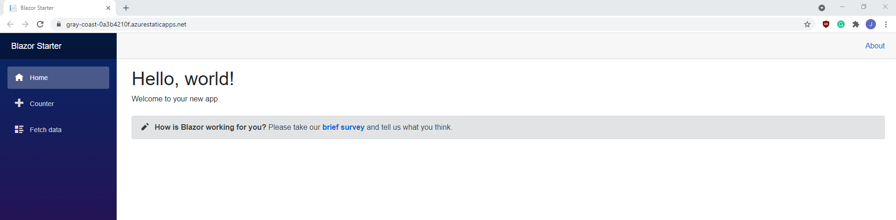

# Blazor Application

This Blazor project consists of:

- a counter page that counts by 5
- a weather page that fetches weather data with an API
- a pay calculation page that calculates the total pay earned in a week given the pay rate and hours worked
- a todo list page that accepts tasks as input and displays the number remaining

The todo list component was made using a [Microsoft tutorial](https://docs.microsoft.com/en-us/aspnet/core/tutorials/build-a-blazor-app).

The Blazor app can be accessed [here](https://gray-coast-0a3b4210f.azurestaticapps.net).